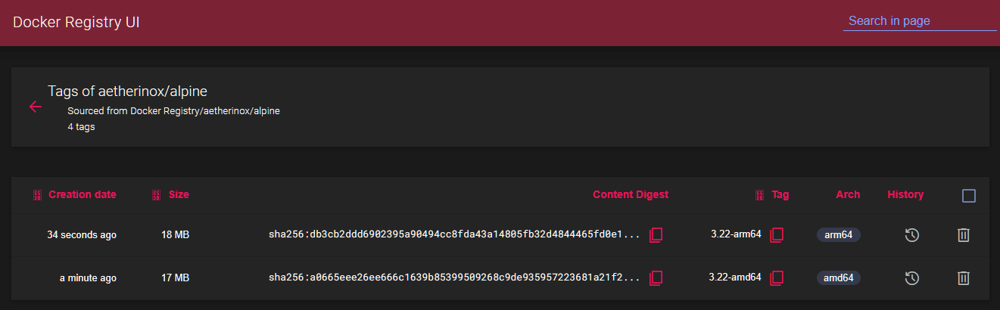
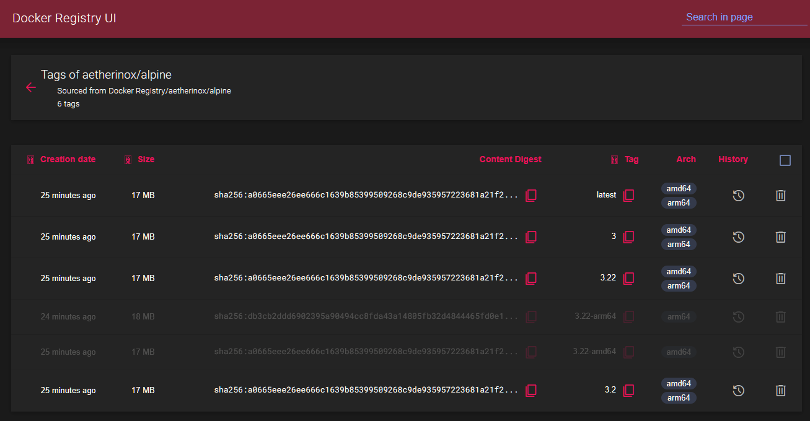
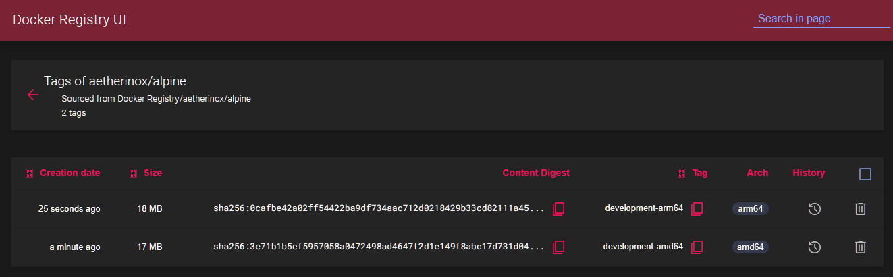
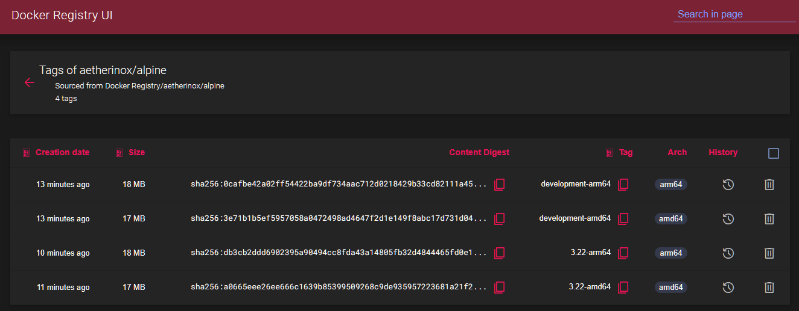
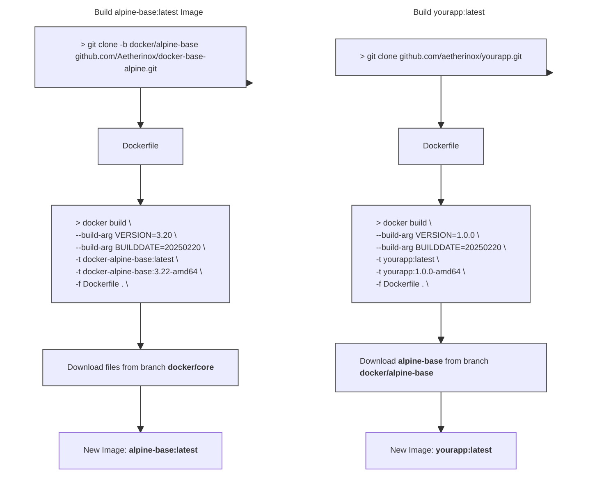

<div align="center">
<h6>Docker Image using alpine and s6-overlay</h6>
<h1>💿 Alpine - Base Image 💿</h1>

<br />

This branch `docker/base-alpine` contains the base docker alpine image which is utilized as a base for creating other images. This alpine image is what you will derive your app's Dockerfile from.

Normal users should not need to modify the files in this repository.
 
</p>

<br />


<br />
<br />

<!-- prettier-ignore-start -->
[![Version][dockerhub-version-img]][dockerhub-version-uri]
[![Dockerhub Pulls][dockerhub-pulls-img]][dockerhub-pulls-uri]
[![Github Pulls][github-pulls-img]][github-pulls-uri]
[![Size][github-size-img]][github-size-img]
[![Last Commit][github-commit-img]][github-commit-img]
[![Contributors][contribs-all-img]](#contributors-)
<!-- prettier-ignore-end -->

</div>

<br />

---

<br />

- [About](#about)
  - [Features](#features)
  - [Read First](#read-first)
- [Building Image](#building-image)
  - [Before Building](#before-building)
    - [LF over CRLF](#lf-over-crlf)
    - [Set `+x / 0755` Permissions](#set-x--0755-permissions)
  - [Build Images](#build-images)
    - [Build Single Architecture](#build-single-architecture)
      - [amd64](#amd64)
      - [arm64](#arm64)
    - [Build All Architectures \& Manifest](#build-all-architectures--manifest)
      - [Stable - amd64](#stable---amd64)
      - [Stable - arm64](#stable---arm64)
      - [Development - amd64](#development---amd64)
      - [Development - arm64](#development---arm64)
- [Using Image](#using-image)
- [Extra Notes](#extra-notes)
  - [Accessing Container Shell](#accessing-container-shell)
    - [ash](#ash)
    - [sh](#sh)
    - [bash](#bash)
  - [Custom Docker Image Scripts](#custom-docker-image-scripts)
  - [SSL Certificates](#ssl-certificates)
  - [Logs](#logs)


<br />

---

<br />

## About

The files contained within this branch `docker/alpine-base` are utilized as a foundation. This base image only provides us with a docker image which has alpine linux, Nginx, a few critical packages, and the **[s6-overlay](https://github.com/just-containers/s6-overlay)** plugin.

This branch `docker/alpine-base` does **NOT** contain any applications. It is only to be used as a base image which will be called when you build your docker app's `📄 Dockerfile`.

<br />
<br />

### Features

This docker image includes the following features:

* Simple init process which allows the end-user to execute tasks like initialization (`cont-init.d`),
finalization (`cont-finish.d`) and their own services with dependencies between them
* s6-overlay integration provides proper `PID 1` functionality
  * You'll never have zombie processes hanging around in your container, they are properly managed and cleaned up.
* Multiple processes in a single container
* Distributed as a small number of .tar.xz files depending on what exact functionality you need - to keep your image's number of layers small.
* A whole set of utilities included in `s6` and `s6-portable-utils`. Includes handy and composable utilities which make life much easier.
* Log rotating out-of-the-box through `logutil-service` which uses [`s6-log`](https://skarnet.org/software/s6/s6-log.html) under the hood.
* Support for Docker's `USER` directive, to run your whole process tree as a specific user.

<br />

### Read First

<br />
<br />

To build a docker image using this base and the actual app you want to release, you need two different docker images:

- **Step 1**: Build **[docker/alpine-base](https://github.com/Aetherinox/docker-base-alpine/tree/docker/alpine-base)** image **(this repo)**
  - When being built, the alpine-base `📄 Dockerfile` will grab and install the files from the branch **[docker/core](https://github.com/Aetherinox/docker-base-alpine/tree/docker/core)**
- **Step 2**: Build your app's docker image that will run on top of this alpine image
- **Step 3**: Release the docker image built from **Step 2** to Github's **Ghcr.io** or **hub.docker.com**

<br />

> [!WARNING]
> You should NOT need to modify any of the files within this branch `docker/alpine-base` unless you absolutely know what you are doing.

<br />

When you build this **[docker/alpine-base](https://github.com/Aetherinox/docker-base-alpine/tree/docker/alpine-base)** image, the `📄 Dockerfile` will request files from another branch we host, which is the **[docker/core](https://github.com/Aetherinox/docker-base-alpine/tree/docker/core)** branch.

```bash
ADD --chmod=755 "https://raw.githubusercontent.com/Aetherinox/docker-base-alpine/docker/core/docker-images.${MODS_VERSION}" "/docker-images"
ADD --chmod=755 "https://raw.githubusercontent.com/Aetherinox/docker-base-alpine/docker/core/package-install.${PKG_INST_VERSION}" "/etc/s6-overlay/s6-rc.d/init-mods-package-install/run"
ADD --chmod=755 "https://raw.githubusercontent.com/Aetherinox/docker-base-alpine/docker/core/aetherxown.${AETHERXOWN_VERSION}" "/usr/bin/aetherxown"
```

<br />

`aetherxown` is vital and must be included in the base image you build. It is what controls the **USER : GROUP** permissions that will be handled within your docker image. 

For this reason, there are a few requirements you can read about below in the section **[Before Building](#before-building)**.

<br />

---

<br >

## Building Image

These instructions outline how the alpine docker image is set up, and how to build your own docker image.

<br />

### Before Building

Prior to building the  docker image, you **must** ensure the sections below are completed.

- [LF over CRLF](#lf-over-crlf)
- [Set +x / 0755 Permissions](#set-x--0755-permissions)

<br />

You must ensure when you build this docker image **[docker/alpine-base](https://github.com/Aetherinox/docker-base-alpine/tree/docker/alpine-base)**, the following conditions must be met. 

<br />

If the listed tasks above are not performed, your docker container will throw the following errors when started:

- `Failed to open apk database: Permission denied`
- `s6-rc: warning: unable to start service init-adduser: command exited 127`
- `unable to exec /etc/s6-overlay/s6-rc.d/init-envfile/run: Permission denied`
- `/etc/s6-overlay/s6-rc.d/init-adduser/run: line 34: aetherxown: command not found`
- `/etc/s6-overlay/s6-rc.d/init-adduser/run: /usr/bin/aetherxown: cannot execute: required file not found`

<br />

#### LF over CRLF

You cannot utilize Windows' `Carriage Return Line Feed`. All files must be converted to Unix' `Line Feed`.  This can be done with **[Visual Studio Code](https://code.visualstudio.com/)**. OR; you can run the Linux terminal command `🗔 dos2unix` to convert these files.

For the branches **[docker/alpine-base](https://github.com/Aetherinox/docker-base-alpine/tree/docker/alpine-base)** and your main app image, you can use the following recursive commands:

<br />

> [!CAUTION]
> Be careful using the command to change **ALL** files. You should **NOT** change the files in your `📁 .git` folder, otherwise you will corrupt your git indexes.
>
> If you accidentally run `🗔 dos2unix` on your `📁 .git` folder, do NOT push anything to git. Pull a new copy from the repo or reset your local files back to the remote:
> 
> ```shell
> git reset --hard origin/main
> ```

<br />

```shell
# Change ALL files
find ./ -type f | grep -Ev '.git|*.jpg|*.jpeg|*.png' | xargs dos2unix --

# Change run / binaries
find ./ -type f -name 'run' | xargs dos2unix --
```

<br />

For the branch **[docker/core](https://github.com/Aetherinox/docker-base-alpine/tree/docker/core)**, you can use the following commands:

```shell
dos2unix docker-images.v3
dos2unix aetherxown.v1
dos2unix package-install.v1
dos2unix with-contenv.v1
```

<br />

#### Set `+x / 0755` Permissions

The files contained within this repo **MUST** have `chmod 755` /  `+x` executable permissions. If you are using our Github workflow sample **[deploy-docker-github.yml](https://github.com/Aetherinox/docker-base-alpine/blob/workflows/samples/deploy-docker-github.yml)**, this is done automatically. If you are building the images manually; you need to do this. Ensure those files have the correct permissions prior to building the Alpine base docker image.

If you are building the **[docker/alpine-base](https://github.com/Aetherinox/docker-base-alpine/tree/docker/alpine-base)** or your main application images, you must ensure the files in those branches have the proper permissions. All of the executable files are named `run`:

```shell
find ./ -name 'run' -exec sudo chmod +x {} \;
```

<br />

<sub><sup>Optional - </sup></sub> If you want to set the permissions manually, run the following below. If you executed the `find` command above, you don't need to run the list of commands below:

```shell
sudo chmod +x ./root/etc/s6-overlay/s6-rc.d/init-adduser/run \
  ./root/etc/s6-overlay/s6-rc.d/init-crontab-config/run \
  ./root/etc/s6-overlay/s6-rc.d/init-custom-files/run \
  ./root/etc/s6-overlay/s6-rc.d/init-envfile/run \
  ./root/etc/s6-overlay/s6-rc.d/init-folders/run \
  ./root/etc/s6-overlay/s6-rc.d/init-keygen/run \
  ./root/etc/s6-overlay/s6-rc.d/init-migrations/run \
  ./root/etc/s6-overlay/s6-rc.d/init-permissions/run \
  ./root/etc/s6-overlay/s6-rc.d/init-samples/run \
  ./root/etc/s6-overlay/s6-rc.d/init-version-checks/run \
  ./root/etc/s6-overlay/s6-rc.d/svc-cron/run \
  ./root/etc/s6-overlay/s6-rc.d/svc-php-fpm/run \
  ./root/etc/s6-overlay/s6-rc.d/svc-nginx/run \
  ./root/etc/s6-overlay/s6-rc.d/init-php/run \
  ./root/etc/s6-overlay/s6-rc.d/init-nginx/run
```

<br />

For the branch **[docker/core](https://github.com/Aetherinox/docker-base-alpine/tree/docker/core)**, there are a few files to change. The ending version number may change, but the commands to change the permissions are as follows:

```shell
sudo chmod +x docker-images.v3 \
  chmod +x aetherxown.v1 \
  chmod +x package-install.v1 \
  chmod +x with-contenv.v1
```

<br />
<br />

### Build Images

After completing the steps above; we will now build the [🔆 docker/alpine-base](https://github.com/Aetherinox/docker-base-alpine/tree/docker/core) image.

<br />

Open the `📄 Dockerfile` and ensure you are pulling the correct Alpine base image. This code is located near the top of the `📄 Dockerfile`:

```dockerfile
ARG ALPINE_VERSION=3.22
FROM alpine:${ALPINE_VERSION} AS rootfs-stage

ARG ARCH=x86_64
ARG REPO_AUTHOR="aetherinox"
ARG REPO_NAME="docker-base-alpine"
ARG S6_OVERLAY_VERSION="3.2.1.0"
ARG S6_OVERLAY_ARCH="${ARCH}"
```

<br />

> [!NOTE]
> The `ARCH` argument supports two options; which you will specify by using the argument `--build-arg ARCH=x86_64` in your buildx command:
> 
> - `x86_64`
> - `aarch64`

<br />

Next, select which type of image you want to build below.

- [Build Single Architecture](#build-single-architecture)
- [Build All Architectures & Manifest](#build-all-architectures--manifest)

<br />
<br />

#### Build Single Architecture

All of the needed Docker files already exist in the repository. To get started, clone the repo to a folder

```shell
mkdir docker-alpine && cd docker-alpine

# to clone from our github website
git clone https://github.com/Aetherinox/docker-base-alpine.git --branch docker/alpine-base .
```

<br />

If you do not need to build both `amd64` and `arm64`, you can simply build one architecture. First, create a new buildx container:

```shell
docker buildx create --driver docker-container --name container --bootstrap --use
```

<br />

<sub><sup>Optional - </sup></sub> If you first need to remove the provider container because you created it previously, run the command:

```shell
docker buildx rm container
docker buildx create --driver docker-container --name container --bootstrap --use
```

<br />

To list all buildx build containers, run:

```shell
docker buildx ls
```

<br />

Before you can push the image, ensure you are signed into Docker CLI. Open your Linux terminal and see if you are already signed in:

```shell
docker info | grep Username
```

<br />

If nothing is printed; then you are not signed in. Initiate the web login:

```shell
docker login
```

<br />

Some text will appear on-screen, copy the code, open your browser, and go to https://login.docker.com/activate

```console
USING WEB BASED LOGIN
To sign in with credentials on the command line, use 'docker login -u <username>'

Your one-time device confirmation code is: XXXX-XXXX
Press ENTER to open your browser or submit your device code here: https://login.docker.com/activate

Waiting for authentication in the browser…
```

<br />

Once finished in your browser, return to your Linux terminal, and it should bring you back to where you can type a command. You can now verify again if you are signed in:

```shell
docker info | grep Username
```

<br />

You should see your name:

```console
 Username: aetherinox
```

<br />

You are ready to build the alpine docker image, run the command for your platform:

<br />

##### amd64

Creates the alpine `amd64` docker image:

```shell
# Build alpine amd64
docker buildx build \
  --build-arg ARCH=x86_64 \
  --build-arg VERSION=3.22 \
  --build-arg BUILDDATE=20260812 \
  --build-arg RELEASE=stable \
  --tag ghcr.io/aetherinox/alpine-base:latest \
  --tag ghcr.io/aetherinox/alpine-base:3 \
  --tag ghcr.io/aetherinox/alpine-base:3.2 \
  --tag ghcr.io/aetherinox/alpine-base:3.22 \
  --tag ghcr.io/aetherinox/alpine-base:3.22-amd64 \
  --attest type=provenance,disabled=true \
  --attest type=sbom,disabled=true \
  --output type=docker \
  --builder default \
  --file Dockerfile \
  --platform linux/amd64 \
  --allow network.host \
  --network host \
  --no-cache \
  --push \
  .
```

<br />

##### arm64

Creates the alpine `arm64` docker image:

```shell
# Build alpine arm64
docker buildx build \
  --build-arg ARCH=aarch64 \
  --build-arg VERSION=3.22 \
  --build-arg BUILDDATE=20260812 \
  --build-arg RELEASE=stable \
  --tag ghcr.io/aetherinox/alpine-base:latest \
  --tag ghcr.io/aetherinox/alpine-base:3 \
  --tag ghcr.io/aetherinox/alpine-base:3.2 \
  --tag ghcr.io/aetherinox/alpine-base:3.22 \
  --tag ghcr.io/aetherinox/alpine-base:3.22-arm64 \
  --attest type=sbom,disabled=true \
  --output type=docker \
  --builder default \
  --file Dockerfile \
  --platform linux/arm64 \
  --allow network.host \
  --network host \
  --no-cache \
  --push \
  .
```

<br />

> [!NOTE]
> If you want to only build the alpine docker image locally; remove `--push`.

<br />

After building the image, you can now use the image either with `🗔 docker run` or a `📄 docker-compose.yml` file. These instructions are available by skipping down to the sections:

- [🗔 Docker Run](#docker-run-1)
- [📄 Docker Compose](#docker-compose-1)


<br />
<br />

#### Build All Architectures & Manifest

These instructions tell you how to build the `stable` and `development` releases for both the `amd64` and `arm64` architectures. Then you will combine all manifests into one release.

All of the needed Docker files already exist in the repository. To get started, clone the repo to a folder

```shell
mkdir docker-alpine && cd docker-alpine

# to clone from our github website
git clone https://github.com/Aetherinox/docker-base-alpine.git --branch docker/alpine-base .
```

<br />

First, create a new buildx container:

```shell
docker buildx create --driver docker-container --name container --bootstrap --use
```

<br />

<sub><sup>Optional - </sup></sub> If you first need to remove the container because you created it previously, run the command:

```shell
docker buildx rm container
docker buildx create --driver docker-container --name container --bootstrap --use
```

<br />

To list all buildx build containers, run:

```shell
docker buildx ls
```

<br />

Before you can push the image, ensure you are signed into Docker CLI. Open your Linux terminal and see if you are already signed in:

```shell
docker info | grep Username
```

<br />

If nothing is printed; then you are not signed in. Initiate the web login:

```shell
docker login
```

<br />

Some text will appear on-screen, copy the code, open your browser, and go to https://login.docker.com/activate

```console
USING WEB BASED LOGIN
To sign in with credentials on the command line, use 'docker login -u <username>'

Your one-time device confirmation code is: XXXX-XXXX
Press ENTER to open your browser or submit your device code here: https://login.docker.com/activate

Waiting for authentication in the browser…
```

<br />

Once you are finished in your browser, you can return to your Linux terminal, and it should bring you back to where you can type a command. You can now verify again if you are signed in:

```shell
docker info | grep Username
```

<br />

You should see your name:

```console
 Username: aetherinox
```

<br />

Next, in order to build the `amd64` and `arm64` images on the same machine; you must install **QEMU** which is an emulator. Open your terminal and run the following command:

```shell
docker run --privileged --rm tonistiigi/binfmt --install all
```

<br />

If you are building these docker images using Github workflow, you will also need to use `QEMU` with the following action:

```yml
            - name: '⚙️ Set up QEMU'
              id: task_release_gh_qemu
              uses: docker/setup-qemu-action@v3
```

<br />

Once the emulator is installed; we will now build two images. When building these two images; we will ensure the `--tag` value is different for each one, by adding the architecture to the end. This ensures we don't overwrite one image with the newer one. We need to have two seperate docker images with two different tags.

- `--tag ghcr.io/aetherinox/alpine-base:3.22-amd64`
- `--tag ghcr.io/aetherinox/alpine-base:3.22-arm64`

<br />

> [!NOTE]
> The build commands below will push the docker image to Github's GHCR registry. If you wish to use another registry, edit the **--tag**:
>
> The `--tag <registry>` argument is what determines what registry your image will be pushed to. You can change this to any registry:
> 
> | Registry | Tag |
> | --- | --- |
> | Dockerhub | `--tag aetherinox/alpine-base:3.22-amd64`<br>`--tag aetherinox/alpine-base:3.22-arm64` |
> | Github (GHCR) | `--tag ghcr.io/aetherinox/alpine-base:3.22-amd64`<br>`--tag ghcr.io/aetherinox/alpine-base:3.22-arm64` |
> | Registry v2 | `--tag registry.domain.lan/aetherinox/alpine-base:3.22-amd64`<br>`--tag registry.domain.lan/aetherinox/alpine-base:3.22-arm64` |
> | Gitea | `--tag git.binaryninja.net/aetherinox/alpine-base:3.22-amd64`<br>`--tag git.binaryninja.net/aetherinox/alpine-base:3.22-arm64` |

<br />

After we build these two images and push them to a registry online; merge them into a single docker image which contains both arcitectures.

<br />

> [!WARNING]
> In order to merge the two architecture images into one; you **MUST** `--push` each of the two docker images to a registry first. You cannot modify the manifests locally.

<br />

##### Stable - amd64

Creates the alpine **Stable** release `amd64` docker image:

```shell
# Build alpine amd64 - (stable release)
docker buildx build \
  --build-arg ARCH=x86_64 \
  --build-arg VERSION=3.22 \
  --build-arg BUILDDATE=20260812 \
  --build-arg RELEASE=stable \
  --tag ghcr.io/aetherinox/alpine-base:3.22-amd64 \
  --attest type=provenance,disabled=true \
  --attest type=sbom,disabled=true \
  --output type=docker \
  --builder default \
  --file Dockerfile \
  --platform linux/amd64 \
  --allow network.host \
  --network host \
  --no-cache \
  --pull \
  --push \
  .
```

<br />

##### Stable - arm64

Creates the Alpine **Stable** release `arm64` docker image:

```shell
# Build alpine arm64 - (stable release)
docker buildx build \
  --build-arg ARCH=aarch64 \
  --build-arg VERSION=3.22 \
  --build-arg BUILDDATE=20260812 \
  --build-arg RELEASE=stable \
  --tag ghcr.io/aetherinox/alpine-base:3.22-arm64 \
  --attest type=provenance,disabled=true \
  --attest type=sbom,disabled=true \
  --output type=docker \
  --builder default \
  --file Dockerfile \
  --platform linux/arm64 \
  --allow network.host \
  --network host \
  --no-cache \
  --pull \
  --push \
  .
```

<br />

##### Development - amd64

Creates the Alpine **Development** release `amd64` docker image:

```shell
# Build alpine amd64 - (development release)
docker buildx build \
  --build-arg ARCH=x86_64 \
  --build-arg VERSION=3.22 \
  --build-arg BUILDDATE=20260812 \
  --build-arg RELEASE=development \
  --tag ghcr.io/aetherinox/alpine-base:development-amd64 \
  --attest type=provenance,disabled=true \
  --attest type=sbom,disabled=true \
  --output type=docker \
  --builder default \
  --file Dockerfile \
  --platform linux/amd64 \
  --allow network.host \
  --network host \
  --no-cache \
  --pull \
  --push \
  .
```

<br />

##### Development - arm64

Creates the Alpine **Development** release `arm64` docker image:

```shell
# Build alpine arm64 - (development release)
docker buildx build \
  --build-arg ARCH=aarch64 \
  --build-arg VERSION=3.22 \
  --build-arg BUILDDATE=20260812 \
  --build-arg RELEASE=development \
  --tag ghcr.io/aetherinox/alpine-base:development-arm64 \
  --attest type=provenance,disabled=true \
  --attest type=sbom,disabled=true \
  --output type=docker \
  --builder default \
  --file Dockerfile \
  --platform linux/arm64 \
  --allow network.host \
  --network host \
  --no-cache \
  --pull \
  --push \
  .
```

<br />

After completing the `docker buildx` commands above; you should now have a few new images. Each image should have its own separate docker tags which do not conflict. If you decided to not build the **development** releases below; that is fine.

<br />

- `--tag ghcr.io/aetherinox/alpine-base:3.22-amd64`
- `--tag ghcr.io/aetherinox/alpine-base:3.22-arm64`
- `--tag ghcr.io/aetherinox/alpine-base:development-amd64`
- `--tag ghcr.io/aetherinox/alpine-base:development-arm64`

<br />

Next, we need to take these two images, and merge them into one so that both architectures are available without having to push separate images. You need to obtain the SHA256 hash digest for the `amd64` and `arm64` images. You can go to the registry where you uploaded the images and then copy them. Or you can run the commands specified below depending on which release type you want:

<br />
<br />

**Stable Release**

If you are building the **stable release** images; you should see the following:

<br />

<p align="center"><br><sub><sup><b>Registry v2:</b> Newly created <code>amd64</code> and <code>arm64</code> images</sup></sub></p>

<br />

You can also get the hash digests by running the commands:

```shell
$ docker buildx imagetools inspect ghcr.io/aetherinox/alpine-base:3.22-amd64

Name:      ghcr.io/aetherinox/alpine-base:3.22-amd64
MediaType: application/vnd.docker.distribution.manifest.v2+json
Digest:    sha256:657fd74ebfa6577c069d1d74fec291b8b5309f762e7ad2d0d14b51de64a841b8

$ docker buildx imagetools inspect ghcr.io/aetherinox/alpine-base:3.22-arm64

Name:      ghcr.io/aetherinox/alpine-base:3.22-arm64
MediaType: application/vnd.docker.distribution.manifest.v2+json
Digest:    sha256:2750bb927d8e4434d21c9f9941632310b98bbb2729389af236888ebbc4d75dda
```

<br />
<br />

**Development Release**

If you are building the **development release** images; you should see the following:

<br />

<p align="center"><br><sub><sup><b>Registry v2:</b> Newly created <code>development-amd64</code> and <code>development-arm64</code> images</sup></sub></p>

<br />

You can also get the hash digests by running the commands:

<br />

```shell
$ docker buildx imagetools inspect ghcr.io/aetherinox/alpine-base:development-amd64

Name:      ghcr.io/aetherinox/alpine-base:development-amd64
MediaType: application/vnd.docker.distribution.manifest.v2+json
Digest:    sha256:8f36385a28c8f6eb7394d903c9a7a2765b06f94266b32628389ee9e3e3d7e69d

$ docker buildx imagetools inspect ghcr.io/aetherinox/alpine-base:development-arm64

Name:      ghcr.io/aetherinox/alpine-base:development-arm64
MediaType: application/vnd.docker.distribution.manifest.v2+json
Digest:    sha256:c719ccb034946e3f0625003f25026d001768794e38a1ba8aafc9146291d548c5
```

<br />
<br />

> [!WARNING]
> **Wrong Digest Hashes**
> 
> Be warned that when you push docker images to your docker registry; the `SHA256` hash digest will be different than what you have locally. If you use the following command; these digests will be **incorrect**:
> 
> ```shell
> $ docker images --all --no-trunc | grep aetherinox
> 
> ghcr.io/aetherinox/alpine-base   3.22-arm64        sha256:bb425429e98ab467fd91474701da2e5c0a7cb4a5f218a710d950eb0ff595486c   3 minutes ago   38.8MB
> 
> ghcr.io/aetherinox/alpine-base   3.22-amd64        sha256:dea4cb91379dba289d8d3e8842d4fb7b7857faa7f3d02d5b9a043a1ee58e61d7   4 minutes ago   27.3MB
> ```
>
> To get the correct sha256 digest, use:
> - `docker buildx imagetools inspect ghcr.io/aetherinox/alpine-base:3.22-amd64`
> - `docker buildx imagetools inspect ghcr.io/aetherinox/alpine-base:3.22-arm64`
> - `docker buildx imagetools inspect ghcr.io/aetherinox/alpine-base:development-amd64`
> - `docker buildx imagetools inspect ghcr.io/aetherinox/alpine-base:development-arm64`
> 

<br />
<br />

Once you have the correct `SHA256` hash digests; paste them into the command below. This command is where you can specify the real `--tag` that the public image will have. The previous tags were simply placeholders and no longer matter.

<br />

For the **stable** releases, use:

```shell
# #
#    Image > Stable
# #

docker buildx imagetools create \
  --tag ghcr.io/aetherinox/alpine-base:latest \
  --tag ghcr.io/aetherinox/alpine-base:3 \
  --tag ghcr.io/aetherinox/alpine-base:3.2 \
  --tag ghcr.io/aetherinox/alpine-base:3.22 \

  sha256:657fd74ebfa6577c069d1d74fec291b8b5309f762e7ad2d0d14b51de64a841b8 \
  sha256:2750bb927d8e4434d21c9f9941632310b98bbb2729389af236888ebbc4d75dda

[+] Building 0.2s (4/4) FINISHED                                                                                                                                                                                                      
 => [internal] pushing ghcr.io/aetherinox/alpine-base:latest     0.2s
 => [internal] pushing ghcr.io/aetherinox/alpine-base:3          0.2s
 => [internal] pushing ghcr.io/aetherinox/alpine-base:3.2        0.2s
 => [internal] pushing ghcr.io/aetherinox/alpine-base:3.22       0.2s
```

<br />

For the **development** releases, use:

```shell
# #
#    Image > Development
# #

docker buildx imagetools create \
  --tag ghcr.io/aetherinox/alpine-base:development \
  sha256:2750bb927d8e4434d21c9f9941632310b98bbb2729389af236888ebbc4d75dda \
  sha256:657fd74ebfa6577c069d1d74fec291b8b5309f762e7ad2d0d14b51de64a841b8

[+] Building 0.1s (1/1) FINISHED
 => [internal] pushing ghcr.io/aetherinox/alpine-base:development   0.1s
```

<br />

> [!NOTE]
> Compared to the **stable** release which has 4 tags; the **development** release only has one tag.

<br />

Alternatively, you could use the `🗔 manifest create` command; as an example, you can merge multiple architecture images together into a single image. The top line with `🔖 aetherinox/alpine-base:latest` can be any name. However, all images after `--amend` MUST be already existing images uploaded to the registry.

```shell
docker manifest create ghcr.io/aetherinox/alpine-base:latest \
    --amend ghcr.io/aetherinox/alpine-base:latest-amd64 \
    --amend ghcr.io/aetherinox/alpine-base:latest-arm32v7 \
    --amend ghcr.io/aetherinox/alpine-base:latest-arm64v8

docker manifest push ghcr.io/aetherinox/alpine-base:latest
```

<br />

In this example, we take the existing two files we created earlier, and merge them into one. You can either specify the image by `SHA256 digest`, or tag:

```shell
# Example 1 (using tag)
docker manifest create ghcr.io/aetherinox/alpine-base:latest \
    --amend ghcr.io/aetherinox/alpine-base:3.22-amd64 \
    --amend ghcr.io/aetherinox/alpine-base:3.22-arm64

# Example 2 (using sha256 hash)
docker manifest create ghcr.io/aetherinox/alpine-base:latest \
    --amend ghcr.io/aetherinox/alpine-base@sha256:657fd74ebfa6577c069d1d74fec291b8b5309f762e7ad2d0d14b51de64a841b8 \
    --amend ghcr.io/aetherinox/alpine-base@sha256:2750bb927d8e4434d21c9f9941632310b98bbb2729389af236888ebbc4d75dda

# Push manifest changes to registry
docker manifest push ghcr.io/aetherinox/alpine-base:latest
```

<br />

If you go back to your registry; you should now see multiple new entries, all with different tags. Two of the images are your old `amd64` and `arm64` images, and then you should have your official one with the four tags specified above. You can delete the two original images if you do not want them.

<p align="center"><br><sub><sup><b>Registry v2:</b> Newly created <code>amd64</code> and <code>arm64</code> images, and merged containers with both architectures</sup></sub></p>

<br />
<br />

If you are pushing to Github's GHCR; the interface will look different, as Github merges all tags into a single listing, instead of Registry v2 listing each tag on its own:

<p align="center"><br><sub><sup><b>Registry v2:</b> Newly created <code>amd64</code> and <code>arm64</code> images, and merged containers with both architectures</sup></sub></p>

<br />

The flow of the process is outlined below:



<br />

Once the base alpine image is built, you can now use it to build the actual docker version of your app.

<br />

---

<br />

## Using Image

To use your new docker alpine base image, you simply need to reference it in your project's `📄 Dockerfile`. Open your app's `📄 Dockerfile`, and add:

```dockerfile
ARG ARCH=amd64
ARG ALPINE_VERSION=3.22
FROM --platform=linux/${ARCH} ghcr.io/aetherinox/alpine-base:${ALPINE_VERSION}
```

<br />

In the Dockerfile code above, you will see that we are pulling from `ghcr.io/aetherinox/alpine-base:${ALPINE_VERSION}`; where `${ALPINE_VERSION}` gets replaced with the version of alpine we wish to use. At the time of writing this, it is `3.22`.

<br />

After you reference the alpine image, you can then write the remaining parts of your project's Dockerfile. Once you are ready to build, then build the image, and the alpine base you created an image for earlier will be used as the foundation for whatever project you lay over top of it.

<br />

---

<br />

## Extra Notes

The following are other things to take into consideration when creating the **[docker/alpine-base](https://github.com/Aetherinox/docker-base-alpine/tree/docker/alpine-base)** and your app docker image that will use this base image:

<br />

### Accessing Container Shell

Any project docker image built using this base image contains Alpine Linux, but also includes the `📦 bash` package. Use one of the following to access the shell for this container:

<br />

#### ash

```shell
docker exec -it alpine-base ash
```

<br />

#### sh

```shell
docker exec -it alpine-base sh
```

<br />

#### bash

```shell
docker exec -it alpine-base bash
```

<br />
<br />

### Custom Docker Image Scripts

The `docker/alpine-base` and any project docker images which use this alpine base image, support the ability of adding custom scripts that will be ran when the container is started. To create / add a new custom script to the container, you need to create a new folder in the container source files `/root` folder

```shell
mkdir -p /root/custom-cont-init.d/
```

<br />

Within this new folder, add your custom script:

```shell
nano /root/custom-cont-init.d/my_customs_script
```

<br />

```bash
#!/bin/bash

echo "**** INSTALLING BASH ****"
apk add --no-cache bash
```

<br />

When you create the docker image, this new script will automatically be loaded. You can also do this via the `docker-compose.yml` file by mounting a new volume:

```yml
services:
    yourapp:
        volumes:
            - ./config:/config
            - ./app:/usr/bin/app
            - ./custom-scripts:/custom-cont-init.d:ro
```

<br />

> [!NOTE]
> if using compose, we recommend mounting them **read-only** (`:ro`) so that container processes cannot write to the location.

> [!WARNING]
> The folder `/root/custom-cont-init.d` **MUST** be owned by `root`. If this is not the case, this folder will be renamed and a new empty folder will be created. This is to prevent remote code execution by putting scripts in the aforesaid folder.

<br />

Your main app docker image can contain a custom script called `/root/custom-cont-init.d/plugins`. Do **NOT** edit this script. It is what automatically downloads the official application plugins and adds them to the container.

<br />
<br />

### SSL Certificates

This docker image automatically generates an SSL certificate when the nginx server is brought online. 

<br />

You may opt to either use the generated self-signed certificate, or you can add your own. If you decide to use your own self-signed certificate, ensure you have mounted the `/config` volume in your `docker-compose.yml`:

```yml
services:
    yourapp:
        container_name: yourapp
        image: ghcr.io/thebinaryninja/yourapp:latest                # Image: Github
      # image: thebinaryninja/yourapp:latest                        # Image: Dockerhub
      # image: git.binaryninja.net/binaryninja/yourapp:latest       # Image: Gitea
      # image: yourapp:latest                                       # Image: Locally built
        restart: unless-stopped
        volumes:
            - ./config:/config
            - ./app:/usr/bin/app
```

<br />

Then navigate to the newly mounted folder and add your `📄 cert.crt` and `🔑 cert.key` files to the `📁 /yourapp/keys/*` folder.

<br />

> [!NOTE]
> If you are generating your own certificate and key, we recommend a minimum of:
> - RSA: `2048 bits`
> - ECC: `256 bits`
> - ECDSA: `P-384 or P-521`

<br />
<br />

### Logs

This base alpine image contains detailed logs which will output what the docker container is currently doing.

<br />

---

<br />

<!-- BADGE > GENERAL -->
  [general-npmjs-uri]: https://npmjs.com
  [general-nodejs-uri]: https://nodejs.org
  [general-npmtrends-uri]: http://npmtrends.com/Aetherinox

<!-- BADGE > VERSION > GITHUB -->
  [github-version-img]: https://img.shields.io/github/v/tag/Aetherinox/docker-base-alpine?logo=GitHub&label=Version&color=ba5225
  [github-version-uri]: https://github.com/Aetherinox/docker-base-alpine/releases

<!-- BADGE > VERSION > GITHUB (For the Badge) -->
  [github-version-ftb-img]: https://img.shields.io/github/v/tag/Aetherinox/docker-base-alpine?style=for-the-badge&logo=github&logoColor=FFFFFF&logoSize=34&label=%20&color=ba5225
  [github-version-ftb-uri]: https://github.com/Aetherinox/docker-base-alpine/releases

<!-- BADGE > VERSION > NPMJS -->
  [npm-version-img]: https://img.shields.io/npm/v/Aetherinox?logo=npm&label=Version&color=ba5225
  [npm-version-uri]: https://npmjs.com/package/Aetherinox

<!-- BADGE > VERSION > PYPI -->
  [pypi-version-img]: https://img.shields.io/pypi/v/Aetherinox
  [pypi-version-uri]: https://pypi.org/project/Aetherinox/

<!-- BADGE > LICENSE > MIT -->
  [license-mit-img]: https://img.shields.io/badge/MIT-FFF?logo=creativecommons&logoColor=FFFFFF&label=License&color=9d29a0
  [license-mit-uri]: https://github.com/Aetherinox/docker-base-alpine/blob/main/LICENSE

<!-- BADGE > GITHUB > DOWNLOAD COUNT -->
  [github-downloads-img]: https://img.shields.io/github/downloads/Aetherinox/docker-base-alpine/total?logo=github&logoColor=FFFFFF&label=Downloads&color=376892
  [github-downloads-uri]: https://github.com/Aetherinox/docker-base-alpine/releases

<!-- BADGE > NPMJS > DOWNLOAD COUNT -->
  [npmjs-downloads-img]: https://img.shields.io/npm/dw/%40Aetherinox%2Fdocker-base-alpine?logo=npm&&label=Downloads&color=376892
  [npmjs-downloads-uri]: https://npmjs.com/package/Aetherinox

<!-- BADGE > GITHUB > DOWNLOAD SIZE -->
  [github-size-img]: https://img.shields.io/github/repo-size/Aetherinox/docker-base-alpine?logo=github&label=Size&color=59702a
  [github-size-uri]: https://github.com/Aetherinox/docker-base-alpine/releases

<!-- BADGE > NPMJS > DOWNLOAD SIZE -->
  [npmjs-size-img]: https://img.shields.io/npm/unpacked-size/Aetherinox/latest?logo=npm&label=Size&color=59702a
  [npmjs-size-uri]: https://npmjs.com/package/Aetherinox

<!-- BADGE > CODECOV > COVERAGE -->
  [codecov-coverage-img]: https://img.shields.io/codecov/c/github/Aetherinox/docker-base-alpine?token=MPAVASGIOG&logo=codecov&logoColor=FFFFFF&label=Coverage&color=354b9e
  [codecov-coverage-uri]: https://codecov.io/github/Aetherinox/docker-base-alpine

<!-- BADGE > ALL CONTRIBUTORS -->
  [contribs-all-img]: https://img.shields.io/github/all-contributors/Aetherinox/docker-base-alpine?logo=contributorcovenant&color=de1f6f&label=contributors
  [contribs-all-uri]: https://github.com/all-contributors/all-contributors

<!-- BADGE > GITHUB > BUILD > NPM -->
  [github-build-img]: https://img.shields.io/github/actions/workflow/status/Aetherinox/docker-base-alpine/deploy-docker.yml?logo=github&logoColor=FFFFFF&label=Build&color=%23278b30
  [github-build-uri]: https://github.com/Aetherinox/docker-base-alpine/actions/workflows/deploy-docker.yml

<!-- BADGE > GITHUB > BUILD > Pypi -->
  [github-build-pypi-img]: https://img.shields.io/github/actions/workflow/status/Aetherinox/docker-base-alpine/release-pypi.yml?logo=github&logoColor=FFFFFF&label=Build&color=%23278b30
  [github-build-pypi-uri]: https://github.com/Aetherinox/docker-base-alpine/actions/workflows/pypi-release.yml

<!-- BADGE > GITHUB > TESTS -->
  [github-tests-img]: https://img.shields.io/github/actions/workflow/status/Aetherinox/docker-base-alpine/npm-tests.yml?logo=github&label=Tests&color=2c6488
  [github-tests-uri]: https://github.com/Aetherinox/docker-base-alpine/actions/workflows/npm-tests.yml

<!-- BADGE > GITHUB > COMMIT -->
  [github-commit-img]: https://img.shields.io/github/last-commit/Aetherinox/docker-base-alpine?logo=conventionalcommits&logoColor=FFFFFF&label=Last%20Commit&color=313131
  [github-commit-uri]: https://github.com/Aetherinox/docker-base-alpine/commits/main/

<!-- BADGE > DOCKER HUB > VERSION -->
  [dockerhub-version-img]: https://img.shields.io/docker/v/aetherinox/alpine-base/latest?logo=docker&logoColor=FFFFFF&label=Version&color=ba5225
  [dockerhub-version-uri]: https://hub.docker.com/repository/docker/aetherinox/alpine-base/general

<!-- BADGE > DOCKERHUB > PULLS -->
  [dockerhub-pulls-img]: https://img.shields.io/docker/pulls/aetherinox/alpine-base?logo=docker&logoColor=FFFFFF&label=Pulls&color=376892
  [dockerhub-pulls-uri]: https://hub.docker.com/repository/docker/aetherinox/alpine-base/general

<!-- BADGE > GITHUB > PULLS -->
  [github-pulls-img]: https://img.shields.io/badge/dynamic/json?url=https://ipitio.github.io/backage/Aetherinox/docker-base-alpine/alpine-base.json&query=%24.downloads&logo=github&style=flat&color=376892&label=Pulls
  [github-pulls-uri]: https://github.com/Aetherinox/docker-base-alpine/pkgs/container/alpine-base
