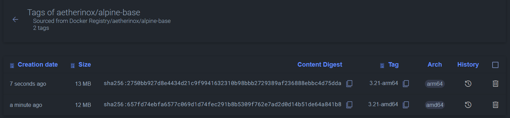
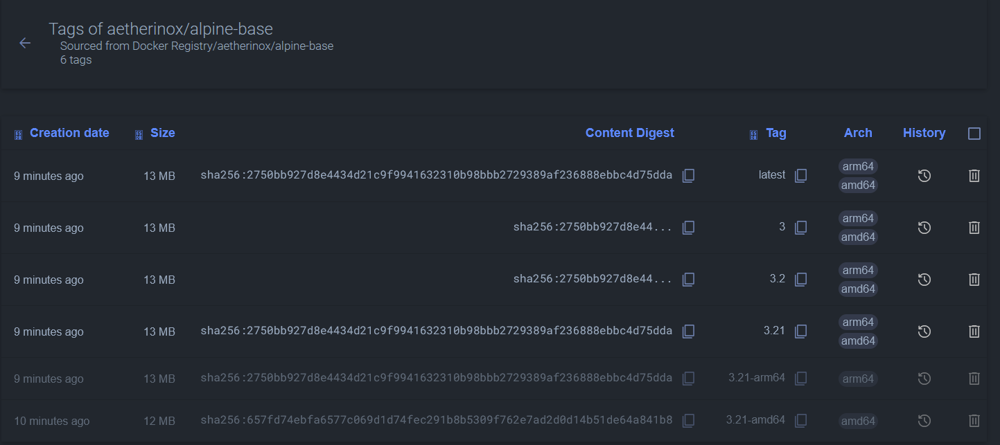
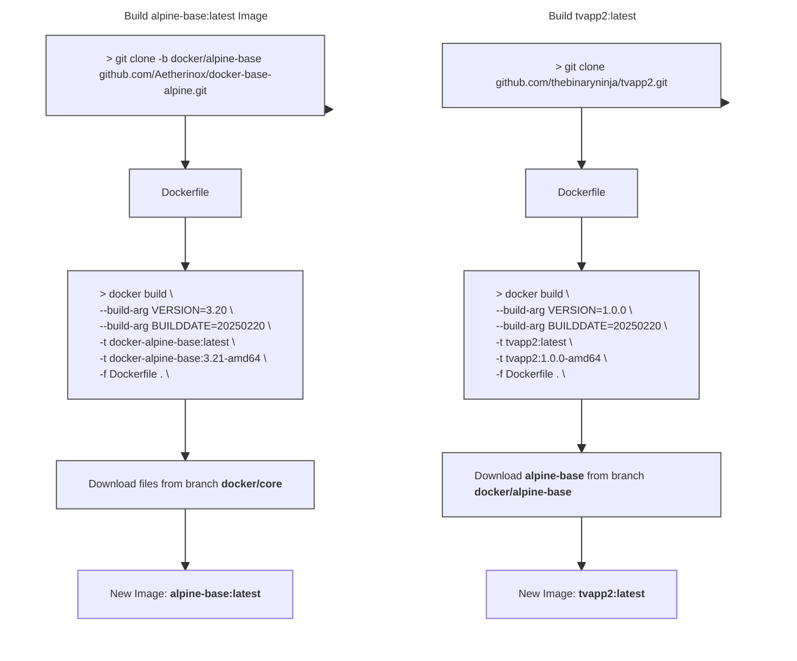

<div align="center">
<h6>Docker Image using alpine and s6-overlay</h6>
<h1>💿 Alpine - Base Image 💿</h1>

<br />

This branch `docker/base-alpine` contains the base docker alpine image which is utilized as a base for creating other images such as **[thebinaryninja/tvapp2](https://github.com/thebinaryninja/tvapp2)**. This alpine image is what you will derive your app's Dockerfile from.

 Normal users should not need to modify the files in this repository.
 
</p>

<br />


<br />
<br />

</div>

<br />

---

<br />

- [About](#about)
- [Before Building](#before-building)
  - [LF over CRLF](#lf-over-crlf)
  - [Set `+x / 0755` Permissions](#set-x--0755-permissions)
- [Build `docker/alpine-base` Image](#build-dockeralpine-base-image)
  - [Build \& Push](#build--push)
    - [Release: Stable](#release-stable)
    - [Release: Development](#release-development)
  - [Build Locally; then Push](#build-locally-then-push)
    - [Release: Stable](#release-stable-1)
    - [Release: Development](#release-development-1)
- [Build `TvApp` Image](#build-tvapp-image)
  - [amd64](#amd64)
  - [arm64 / aarch64](#arm64--aarch64)
  - [Using docker buildx](#using-docker-buildx)
    - [Save Local Image](#save-local-image)
    - [Upload to Registry](#upload-to-registry)
  - [Upload to hub.docker.com / ghcr.io / local](#upload-to-hubdockercom--ghcrio--local)
  - [Image Tags](#image-tags)
- [Using TvApp Image](#using-tvapp-image)
  - [docker run](#docker-run)
  - [docker-compose.yml](#docker-composeyml)
- [Extra Notes](#extra-notes)
  - [Custom Scripts](#custom-scripts)
  - [SSL Certificates](#ssl-certificates)
  - [Access Shell / Bash](#access-shell--bash)
  - [Logs](#logs)


<br />

---

<br />

## About
The files contained within this branch `docker/alpine-base` are utilized as a foundation. This base image only provides us with a docker image which has alpine linux, Nginx, a few critical packages, and the **[s6-overlay](https://github.com/just-containers/s6-overlay)** plugin.

This branch `docker/alpine-base` does **NOT** contain any applications. For our example, we will use the application **[thebinaryninja/tvapp2](https://github.com/thebinaryninja/tvapp2)**.

<br />

To build a docker image using this base and the actual app you want to release (TVApp2), you need two different docker images:
- **Step 1**: Build **[docker/alpine-base](https://github.com/Aetherinox/docker-base-alpine/tree/docker/alpine-base)** image **(this repo)**
  - When being build, the alpine-base `Dockerfile` will grab and install the files from the branch **[docker/core](https://github.com/Aetherinox/docker-base-alpine/tree/docker/core)**
- **Step 2**: Build **[thebinaryninja/tvapp2](https://github.com/thebinaryninja/tvapp2)** image
- **Step 3**: Release the docker image built from **Step 2** to Github's **Ghcr.io** or **hub.docker.com**

<br />

> [!WARNING]
> You should NOT need to modify any of the files within this branch `docker/alpine-base` unless you absolutely know what you are doing.

<br />

When you build this **[docker/alpine-base](https://github.com/Aetherinox/docker-base-alpine/tree/docker/alpine-base)** image, the `Dockerfile` will request files from another branch we host, which is the **[docker/core](https://github.com/Aetherinox/docker-base-alpine/tree/docker/core)** branch.

```bash
ADD --chmod=755 "https://raw.githubusercontent.com/Aetherinox/docker-base-alpine/docker/core/docker-images.${MODS_VERSION}" "/docker-images"
ADD --chmod=755 "https://raw.githubusercontent.com/Aetherinox/docker-base-alpine/docker/core/package-install.${PKG_INST_VERSION}" "/etc/s6-overlay/s6-rc.d/init-mods-package-install/run"
ADD --chmod=755 "https://raw.githubusercontent.com/Aetherinox/docker-base-alpine/docker/core/aetherxown.${AETHERXOWN_VERSION}" "/usr/bin/aetherxown"
```

<br />

`aetherxown` is vital and must be included in the base image you build. It is what controls the **USER : GROUP** permissions that will be handled within your docker image. 

For this reason, there are a few requirements you can read about below in the section **[Before Building](#before-building)**.

<br />

---

<br >

## Before Building

Prior to building the **[docker/alpine-base](https://github.com/Aetherinox/docker-base-alpine/tree/docker/alpine-base)** and **[thebinaryninja/tvapp2](https://github.com/thebinaryninja/tvapp2)** docker images, you **must** ensure the following conditions are met. If the below tasks are not performed, your docker container will throw the following errors when started:

- `Failed to open apk database: Permission denied`
- `s6-rc: warning: unable to start service init-adduser: command exited 127`
- `unable to exec /etc/s6-overlay/s6-rc.d/init-envfile/run: Permission denied`
- `/etc/s6-overlay/s6-rc.d/init-adduser/run: line 34: aetherxown: command not found`
- `/etc/s6-overlay/s6-rc.d/init-adduser/run: /usr/bin/aetherxown: cannot execute: required file not found`

<br />

### LF over CRLF

You cannot utilize Windows' `Carriage Return Line Feed`. All files must be converted to Unix' `Line Feed`.  This can be done with **[Visual Studio Code](https://code.visualstudio.com/)**. OR; you can run the Linux terminal command `dos2unix` to convert these files.

For the branches **[docker/alpine-base](https://github.com/Aetherinox/docker-base-alpine/tree/docker/alpine-base)** and **[thebinaryninja/tvapp2](https://github.com/thebinaryninja/tvapp2)**, you can use the following recursive commands:

<br />

> [!CAUTION]
> Be careful using the command to change **ALL** files. You should **NOT** change the files in your `.git` folder, otherwise you will corrupt your git indexes.
>
> If you accidentally run dos2unix on your `.git` folder, do NOT push anything to git. Pull a new copy from the repo.

<br />

```shell
#Change ALL files
find ./ -type f | grep -Ev '.git|*.jpg|*.jpeg|*.png' | sudo xargs dos2unix --

# Change run / binaries
find ./ -type f -name 'run' | sudo xargs dos2unix --
```

<br />

For the branch **[docker/core](https://github.com/Aetherinox/docker-base-alpine/tree/docker/core)**, you can use the following commands:

```shell
dos2unix docker-images.v3
dos2unix aetherxown.v1
dos2unix package-install.v1
dos2unix with-contenv.v1
```

<br />

### Set `+x / 0755` Permissions

The files contained within this repo **MUST** have `chmod 755` /  `+x` executable permissions. If you are using our Github workflow sample **[deploy-docker-github.yml](https://github.com/Aetherinox/docker-base-alpine/blob/workflows/samples/deploy-docker-github.yml)**, this is done automatically. If you are building the images manually; you need to do this. Ensure those files have the correct permissions prior to building the Alpine base docker image.

If you are building the **[docker/alpine-base](https://github.com/Aetherinox/docker-base-alpine/tree/docker/alpine-base)** or **[thebinaryninja/tvapp2](https://github.com/thebinaryninja/tvapp2)** images, you must ensure the files in those branches have the proper permissions. All of the executable files are named `run`:

```shell
find ./ -name 'run' -exec sudo chmod +x {} \;
```

<br />

If you want to set the permissions manually, run the following:

```shell
sudo chmod +x ./root/etc/s6-overlay/s6-rc.d/init-adduser/run \
  ./root/etc/s6-overlay/s6-rc.d/init-crontab-config/run \
  ./root/etc/s6-overlay/s6-rc.d/init-custom-files/run \
  ./root/etc/s6-overlay/s6-rc.d/init-envfile/run \
  ./root/etc/s6-overlay/s6-rc.d/init-folders/run \
  ./root/etc/s6-overlay/s6-rc.d/init-keygen/run \
  ./root/etc/s6-overlay/s6-rc.d/init-migrations/run \
  ./root/etc/s6-overlay/s6-rc.d/init-permissions/run \
  ./root/etc/s6-overlay/s6-rc.d/init-samples/run \
  ./root/etc/s6-overlay/s6-rc.d/init-version-checks/run \
  ./root/etc/s6-overlay/s6-rc.d/svc-cron/run \
  ./root/etc/s6-overlay/s6-rc.d/svc-php-fpm/run \
  ./root/etc/s6-overlay/s6-rc.d/svc-nginx/run \
  ./root/etc/s6-overlay/s6-rc.d/init-php/run \
  ./root/etc/s6-overlay/s6-rc.d/init-nginx/run
```

<br />

For the branch **[docker/core](https://github.com/Aetherinox/docker-base-alpine/tree/docker/core)**, there are a few files to change. The ending version number may change, but the commands to change the permissions are as follows:

```shell
sudo chmod +x docker-images.v3 \
  chmod +x aetherxown.v1 \
  chmod +x package-install.v1 \
  chmod +x with-contenv.v1
```

<br />

---

<br />

## Build `docker/alpine-base` Image

In order to use the files in this repo `docker/alpine-base`, clone the branch:

```shell
git clone -b docker/alpine-base https://github.com/aetherinox/docker-base-alpine.git .
```

<br />

Once cloned, you can now make whatever adjustments you deem fit to the docker image (updates, new packages, etc). After your edits are done, you will need to do the following:

- Build two new docker images with different tags:
  - `aetherinox/alpine-base:3.21-amd64`
  - `aetherinox/alpine-base:3.21-arm64`
- Merge the two docker images together to make a single docker image which contains both `amd64` and `arm64` by creating a new manifest and pushing the new manifest / image to the docker registry you want.

<br />

Since we are building a docker image for different architectures, we need to install `QEMU` which is an emulator. Open your terminal and run the following command:

```shell
docker run --privileged --rm tonistiigi/binfmt --install all
```

<br />

If you are building these docker images using Github workflow, you will also need to use `QEMU` with the following action:

```yml
            - name: '⚙️ Set up QEMU'
              id: task_release_gh_qemu
              uses: docker/setup-qemu-action@v3
```

<br />
<br />

Before we build the images; keep note that in order to merge the two docker images `amd64` and `arm64` together, you must first push the docker images to a registry. We provide instructions on how to push directly to a registry, or building the images locally and then pushing. Select an option below:

- [Build & Push](#build--push)
- [Build Locally; then Push](#build-locally-then-push)

<br />

### Build & Push

This option allows you to build each docker image for `amd64` and `arm64` and then directly push / upload the docker image to a registry. Open your terminal and run the commands below. These commands will use the argument `--push` which means that right after the image is built, it is pushed to a registry depending on what tag is used.

<br />

#### Release: Stable

```shell
# alpine-base - Stable (amd64): using docker buildx
docker buildx build \
  --network host \
  --build-arg ARCH=x86_64 \
  --build-arg VERSION=3.21 \
  --build-arg BUILDDATE=20250321 \
  --file Dockerfile \
  --platform linux/amd64 \
  --attest type=provenance,disabled=true \
  --attest type=sbom,disabled=true \
  --output type=docker \
  --no-cache \
  --tag ghcr.io/aetherinox/alpine-base:3.21-amd64 \
  --pull \
  --push \
  .

# alpine-base - Stable (arm64): using docker buildx
docker buildx build \
  --network host \
  --build-arg ARCH=aarch64 \
  --build-arg VERSION=3.21 \
  --build-arg BUILDDATE=20250321 \
  --file Dockerfile \
  --platform linux/arm64 \
  --attest type=provenance,disabled=true \
  --attest type=sbom,disabled=true \
  --output type=docker \
  --no-cache \
  --tag ghcr.io/aetherinox/alpine-base:3.21-arm64 \
  --pull \
  --push \
  .
```

<br />

The `--tag <registry>` argument is what determines what registry your image will be pushed to. You can change this to any registry:

| Registry | Tag |
| --- | --- |
| Dockerhub | `--tag aetherinox/alpine-base:3.21-amd64`<br>`--tag aetherinox/alpine-base:3.21-arm64` |
| Github (GHCR) | `--tag ghcr.io/aetherinox/alpine-base:3.21-amd64`<br>`--tag ghcr.io/aetherinox/alpine-base:3.21-arm64` |
| Registry v2 | `--tag registry.domain.lan/aetherinox/alpine-base:3.21-amd64`<br>`--tag registry.domain.lan/aetherinox/alpine-base:3.21-arm64` |
| Gitea | `--tag gitea.domain.lan/aetherinox/alpine-base:3.21-amd64`<br>`--tag gitea.domain.lan/aetherinox/alpine-base:3.21-arm64` |

<br />

#### Release: Development

```shell
# alpine-base - Development (amd64): using docker buildx
docker buildx build \
  --network host \
  --build-arg ARCH=x86_64 \
  --build-arg VERSION=3.21 \
  --build-arg BUILDDATE=20250321 \
  --file Dockerfile \
  --platform linux/amd64 \
  --attest type=provenance,disabled=true \
  --attest type=sbom,disabled=true \
  --output type=docker \
  --no-cache \
  --tag ghcr.io/aetherinox/alpine-base:development-amd64 \
  --pull \
  --push \
  .

# alpine-base - Development (arm64): using docker buildx
docker buildx build \
  --network host \
  --build-arg ARCH=aarch64 \
  --build-arg VERSION=3.21 \
  --build-arg BUILDDATE=20250321 \
  --file Dockerfile \
  --platform linux/arm64 \
  --attest type=provenance,disabled=true \
  --attest type=sbom,disabled=true \
  --output type=docker \
  --no-cache \
  --tag ghcr.io/aetherinox/alpine-base:development-arm64 \
  --pull \
  --push \
  .
```

<br />

The `--tag <registry>` argument is what determines what registry your image will be pushed to. You can change this to any registry:

| Registry | Tag |
| --- | --- |
| Dockerhub | `--tag aetherinox/alpine-base:development-amd64`<br>`--tag aetherinox/alpine-base:development-arm64` |
| Github (GHCR) | `--tag ghcr.io/aetherinox/alpine-base:development-amd64`<br>`--tag ghcr.io/aetherinox/alpine-base:development-arm64` |
| Registry v2 | `--tag registry.domain.lan/aetherinox/alpine-base:development-amd64`<br>`--tag registry.domain.lan/aetherinox/alpine-base:development-arm64` |
| Gitea | `--tag gitea.domain.lan/aetherinox/alpine-base:development-amd64`<br>`--tag gitea.domain.lan/aetherinox/alpine-base:development-arm64` |

<br />

After completing the `docker buildx` commands above; you should now have two new images. Each image should have its own separate docker tags which do not conflict. 

<br />

<p align="center"><br><sub><sup><b>Registry v2:</b> Newly created <code>amd64</code> and <code>arm64</code> images</sup></sub></p>

<br />

Next, we need to take these two images, and merge them into one so that both architectures are available without having to push separate images.  You need to obtain the `SHA256` hash digest of the two different images. You can go to the registry where you uploaded the images and then copy them. Or you can run the following commands:

```shell
$ docker buildx imagetools inspect ghcr.io/aetherinox/alpine-base:3.21-amd64

Name:      ghcr.io/aetherinox/alpine-base:3.21-amd64
MediaType: application/vnd.docker.distribution.manifest.v2+json
Digest:    sha256:657fd74ebfa6577c069d1d74fec291b8b5309f762e7ad2d0d14b51de64a841b8

$ docker buildx imagetools inspect ghcr.io/aetherinox/alpine-base:3.21-arm64

Name:      ghcr.io/aetherinox/alpine-base:3.21-arm64
MediaType: application/vnd.docker.distribution.manifest.v2+json
Digest:    sha256:2750bb927d8e4434d21c9f9941632310b98bbb2729389af236888ebbc4d75dda
```

<br />
<br />

> [!WARNING]
> **Wrong Digest Hashes**
> 
> Be warned that when you push docker images to your docker registry; the `SHA256` hash digest will be different than what you have locally. If you use the following command; these digests will be **incorrect**:
> 
> ```shell
> $ docker images --all --no-trunc | grep aetherinox
> 
> ghcr.io/aetherinox/alpine-base   3.21-arm64        sha256:bb425429e98ab467fd91474701da2e5c0a7cb4a5f218a710d950eb0ff595486c   3 minutes ago   38.8MB
> 
> ghcr.io/aetherinox/alpine-base   3.21-amd64        sha256:dea4cb91379dba289d8d3e8842d4fb7b7857faa7f3d02d5b9a043a1ee58e61d7   4 minutes ago   27.3MB
> ```

<br />
<br />

Once you have the correct `SHA256` hash digests; paste them into the command below.

```shell
# #
#    Image > Stable
# #

docker buildx imagetools create \
  --tag ghcr.io/aetherinox/alpine-base:3.21 \
  --tag ghcr.io/aetherinox/alpine-base:3.2 \
  --tag ghcr.io/aetherinox/alpine-base:3 \
  --tag ghcr.io/aetherinox/alpine-base:latest \
  sha256:2750bb927d8e4434d21c9f9941632310b98bbb2729389af236888ebbc4d75dda \
  sha256:657fd74ebfa6577c069d1d74fec291b8b5309f762e7ad2d0d14b51de64a841b8

# #
#    Image > Development
# #

docker buildx imagetools create \
  --tag ghcr.io/aetherinox/alpine-base:development \
  sha256:2750bb927d8e4434d21c9f9941632310b98bbb2729389af236888ebbc4d75dda \
  sha256:657fd74ebfa6577c069d1d74fec291b8b5309f762e7ad2d0d14b51de64a841b8
```

<br />

Alternatively, you could use the `manifest create` command; as an example, you can merge multiple architecture images together into a single image. The top line with `aetherinox/alpine-base:latest` can be any name. However, all images after `--amend` MUST be already existing images uploaded to the registry.

```shell
docker manifest create ghcr.io/aetherinox/alpine-base:latest \
    --amend ghcr.io/aetherinox/alpine-base:latest-amd64 \
    --amend ghcr.io/aetherinox/alpine-base:latest-arm32v7 \
    --amend ghcr.io/aetherinox/alpine-base:latest-arm64v8

docker manifest push ghcr.io/aetherinox/alpine-base:latest
```

<br />

In this example, we take the existing two files we created earlier, and merge them into one. You can either specify the image by `SHA256 digest`, or tag:

```shell
# Example 1 (using tag)
docker manifest create ghcr.io/aetherinox/alpine-base:latest \
    --amend ghcr.io/aetherinox/alpine-base:3.21-amd64 \
    --amend ghcr.io/aetherinox/alpine-base:3.21-arm64

# Example 2 (using sha256 hash)
docker manifest create ghcr.io/aetherinox/alpine-base:latest \
    --amend ghcr.io/aetherinox/alpine-base@sha256:2750bb927d8e4434d21c9f9941632310b98bbb2729389af236888ebbc4d75dda \
    --amend ghcr.io/aetherinox/alpine-base@sha256:657fd74ebfa6577c069d1d74fec291b8b5309f762e7ad2d0d14b51de64a841b8

# Push manifest changes to registry
docker manifest push ghcr.io/aetherinox/alpine-base:latest
```

<br />

If you go back to your registry; you should now see multiple new entries, all with different tags. Two of the images are your old `amd64` and `arm64` images, and then you should have your official one with the four tags specified above. You can delete the two original images if you do not want them.

<br />

<p align="center"><br><sub><sup><b>Registry v2:</b> Newly created <code>amd64</code> and <code>arm64</code> images, and merged containers with both architectures</sup></sub></p>

<br />
<br />

### Build Locally; then Push

This option allows you to build each docker image for `amd64` and `arm64` and save them locally. Once the images are built; they will **not** be automatically pushed to a registry. These commands will **remove** the argument `--push` which means that right after the image is built, nothing will be pushed to a registry; only that it will be saved locally.

<br />

#### Release: Stable

```shell
# alpine-base - Stable (amd64): using docker buildx
docker buildx build \
  --network host \
  --build-arg ARCH=x86_64 \
  --build-arg VERSION=3.21 \
  --build-arg BUILDDATE=20250321 \
  --file Dockerfile \
  --platform linux/amd64 \
  --attest type=provenance,disabled=true \
  --attest type=sbom,disabled=true \
  --output type=docker \
  --no-cache \
  --tag ghcr.io/aetherinox/alpine-base:3.21-amd64 \
  --pull \
  .

# alpine-base - Stable (arm64): using docker buildx
docker buildx build \
  --network host \
  --build-arg ARCH=aarch64 \
  --build-arg VERSION=3.21 \
  --build-arg BUILDDATE=20250321 \
  --file Dockerfile \
  --platform linux/arm64 \
  --attest type=provenance,disabled=true \
  --attest type=sbom,disabled=true \
  --output type=docker \
  --no-cache \
  --tag ghcr.io/aetherinox/alpine-base:3.21-arm64 \
  --pull \
  .
```

<br />

The `--tag <registry>` argument is what determines what registry your image will be pushed to. You can change this to any registry:

| Registry | Tag |
| --- | --- |
| Dockerhub | `--tag aetherinox/alpine-base:3.21-amd64`<br>`--tag aetherinox/alpine-base:3.21-arm64` |
| Github (GHCR) | `--tag ghcr.io/aetherinox/alpine-base:3.21-amd64`<br>`--tag ghcr.io/aetherinox/alpine-base:3.21-arm64` |
| Registry v2 | `--tag registry.domain.lan/aetherinox/alpine-base:3.21-amd64`<br>`--tag registry.domain.lan/aetherinox/alpine-base:3.21-arm64` |
| Gitea | `--tag gitea.domain.lan/aetherinox/alpine-base:3.21-amd64`<br>`--tag gitea.domain.lan/aetherinox/alpine-base:3.21-arm64` |

<br />

#### Release: Development

```shell
# alpine-base - Development (amd64): using docker buildx
docker buildx build \
  --network host \
  --build-arg ARCH=x86_64 \
  --build-arg VERSION=3.21 \
  --build-arg BUILDDATE=20250321 \
  --file Dockerfile \
  --platform linux/amd64 \
  --attest type=provenance,disabled=true \
  --attest type=sbom,disabled=true \
  --output type=docker \
  --no-cache \
  --tag ghcr.io/aetherinox/alpine-base:development-amd64 \
  --pull \
  --push \
  .

# alpine-base - Development (arm64): using docker buildx
docker buildx build \
  --network host \
  --build-arg ARCH=aarch64 \
  --build-arg VERSION=3.21 \
  --build-arg BUILDDATE=20250321 \
  --file Dockerfile \
  --platform linux/arm64 \
  --attest type=provenance,disabled=true \
  --attest type=sbom,disabled=true \
  --output type=docker \
  --no-cache \
  --tag ghcr.io/aetherinox/alpine-base:development-arm64 \
  --pull \
  --push \
  .
```

<br />

The `--tag <registry>` argument is what determines what registry your image will be pushed to. You can change this to any registry:

| Registry | Tag |
| --- | --- |
| Dockerhub | `--tag aetherinox/alpine-base:development-amd64`<br>`--tag aetherinox/alpine-base:development-arm64` |
| Github (GHCR) | `--tag ghcr.io/aetherinox/alpine-base:development-amd64`<br>`--tag ghcr.io/aetherinox/alpine-base:development-arm64` |
| Registry v2 | `--tag registry.domain.lan/aetherinox/alpine-base:development-amd64`<br>`--tag registry.domain.lan/aetherinox/alpine-base:development-arm64` |
| Gitea | `--tag gitea.domain.lan/aetherinox/alpine-base:development-amd64`<br>`--tag gitea.domain.lan/aetherinox/alpine-base:development-arm64` |

<br />

After completing the `docker buildx` commands above; you should now have two new images. Each image should have its own separate docker tags which do not conflict. Next, we need to take these two images, and merge them into one so that both architectures are available without having to push separate images. 

The issue is that you cannot merge these two images into one until you upload the images to a registry. If you did not specify a registry in your tag; then you will need to first add a tag to each of the two images, The following command will find any image with the tag `alpine-base:3.21-***64` and add a new tag with a specified registry called `ghcr.io/aetherinox/alpine-base:3.21-***64`

```shell
docker image tag alpine-base:3.21-amd64 ghcr.io/aetherinox/alpine-base:3.21-amd64
docker image tag alpine-base:3.21-arm64 ghcr.io/aetherinox/alpine-base:3.21-arm64
```

<br />

Once the tag is added, upload the image to the registry
```shell
docker image push ghcr.io/aetherinox/alpine-base:3.21-amd64
docker image push ghcr.io/aetherinox/alpine-base:3.21-arm64
```

<br />

You need to obtain the `SHA256` hash digest of the two different images. You can go to the registry where you uploaded the images and then copy them. Or you can run the following commands:

```shell
$ docker buildx imagetools inspect ghcr.io/aetherinox/alpine-base:3.21-amd64

Name:      ghcr.io/aetherinox/alpine-base:3.21-amd64
MediaType: application/vnd.docker.distribution.manifest.v2+json
Digest:    sha256:657fd74ebfa6577c069d1d74fec291b8b5309f762e7ad2d0d14b51de64a841b8

$ docker buildx imagetools inspect ghcr.io/aetherinox/alpine-base:3.21-arm64

Name:      ghcr.io/aetherinox/alpine-base:3.21-arm64
MediaType: application/vnd.docker.distribution.manifest.v2+json
Digest:    sha256:2750bb927d8e4434d21c9f9941632310b98bbb2729389af236888ebbc4d75dda
```

<br />
<br />

> [!WARNING]
> **Wrong Digest Hashes**
> 
> Be warned that when you push docker images to your docker registry; the `SHA256` hash digest will be different than what you have locally. If you use the following command; these digests will be **incorrect**:
> 
> ```shell
> $ docker images --all --no-trunc | grep aetherinox
> 
> ghcr.io/aetherinox/alpine-base   3.21-arm64        sha256:bb425429e98ab467fd91474701da2e5c0a7cb4a5f218a710d950eb0ff595486c   3 minutes ago   38.8MB
> 
> ghcr.io/aetherinox/alpine-base   3.21-amd64        sha256:dea4cb91379dba289d8d3e8842d4fb7b7857faa7f3d02d5b9a043a1ee58e61d7   4 minutes ago   27.3MB
> ```

<br />
<br />

Once you have the correct `SHA256` hash digests; paste them into the command below.

```shell
# #
#    Image > Stable
# #

docker buildx imagetools create \
  --tag ghcr.io/aetherinox/alpine-base:3.21 \
  --tag ghcr.io/aetherinox/alpine-base:3.2 \
  --tag ghcr.io/aetherinox/alpine-base:3 \
  --tag ghcr.io/aetherinox/alpine-base:latest \
  sha256:2750bb927d8e4434d21c9f9941632310b98bbb2729389af236888ebbc4d75dda \
  sha256:657fd74ebfa6577c069d1d74fec291b8b5309f762e7ad2d0d14b51de64a841b8

# #
#    Image > Development
# #

docker buildx imagetools create \
  --tag ghcr.io/aetherinox/alpine-base:development \
  sha256:2750bb927d8e4434d21c9f9941632310b98bbb2729389af236888ebbc4d75dda \
  sha256:657fd74ebfa6577c069d1d74fec291b8b5309f762e7ad2d0d14b51de64a841b8
```

<br />

Alternatively, you could use the `manifest create` command; as an example, you can merge multiple architecture images together into a single image. The top line with `aetherinox/alpine-base:latest` can be any name. However, all images after `--amend` MUST be already existing images uploaded to the registry.

```shell
docker manifest create ghcr.io/aetherinox/alpine-base:latest \
    --amend ghcr.io/aetherinox/alpine-base:latest-amd64 \
    --amend ghcr.io/aetherinox/alpine-base:latest-arm32v7 \
    --amend ghcr.io/aetherinox/alpine-base:latest-arm64v8

docker manifest push ghcr.io/aetherinox/alpine-base:latest
```

<br />

In this example, we take the existing two files we created earlier, and merge them into one. You can either specify the image by `SHA256 digest`, or tag:

```shell
# Example 1 (using tag)
docker manifest create ghcr.io/aetherinox/alpine-base:latest \
    --amend ghcr.io/aetherinox/alpine-base:3.21-amd64 \
    --amend ghcr.io/aetherinox/alpine-base:3.21-arm64

# Example 2 (using sha256 hash)
docker manifest create ghcr.io/aetherinox/alpine-base:latest \
    --amend ghcr.io/aetherinox/alpine-base@sha256:2750bb927d8e4434d21c9f9941632310b98bbb2729389af236888ebbc4d75dda \
    --amend ghcr.io/aetherinox/alpine-base@sha256:657fd74ebfa6577c069d1d74fec291b8b5309f762e7ad2d0d14b51de64a841b8

# Push manifest changes to registry
docker manifest push ghcr.io/aetherinox/alpine-base:latest
```

<br />

If you go back to your registry; you should now see multiple new entries, all with different tags. Two of the images are your old `amd64` and `arm64` images, and then you should have your official one with the four tags specified above. You can delete the two original images if you do not want them.

<br />

<p align="center"><br><sub><sup><b>Registry v2:</b> Newly created <code>amd64</code> and <code>arm64</code> images, and merged containers with both architectures</sup></sub></p>

<br />

The flow of the process is outlined below:



<br />

Once the base alpine image is built, you can now build the actual docker version of your app (such as **[thebinaryninja/tvapp2](https://github.com/thebinaryninja/tvapp2)**.

<br />

---

<br />

## Build `TvApp` Image

After the **[docker/alpine-base](https://github.com/Aetherinox/docker-base-alpine/tree/docker/alpine-base)** image is built, you can now use that docker image as a base to build the **[thebinaryninja/tvapp2](https://github.com/thebinaryninja/tvapp2)** image. Navigate to the repo and open the file:

- `Dockerfile`

<br />

Next, specify the **[docker/alpine-base](https://github.com/Aetherinox/docker-base-alpine/tree/docker/alpine-base)** image which will be used as the foundation of the **[thebinaryninja/tvapp2](https://github.com/thebinaryninja/tvapp2)** image:

```dockerfile
ARG ARCH=amd64
FROM --platform=linux/${ARCH} ghcr.io/aetherinox/alpine-base:3.21
```

<br />

After you have completed configuring the **[thebinaryninja/tvapp2](https://github.com/thebinaryninja/tvapp2)** `Dockerfile`, you can now build the image. Remember to build an image for both `amd64` and `aarch64`.

<br />

For the argument `VERSION`; specify the current release of your app (**[thebinaryninja/tvapp2](https://github.com/thebinaryninja/tvapp2)**) which will be contained within the docker image. It should be in the format of `YYYYMMDD`:

<br />

### amd64

```shell
# tvapp2 - amd64: using docker buildx
docker buildx build \
  --build-arg ARCH=amd64 \
  --build-arg VERSION=1.0.0 \
  --build-arg BUILDDATE=20250227 \
  --tag thebinaryninja/tvapp2:latest \
  --tag thebinaryninja/tvapp2:1.0.0-amd64 \
  --file Dockerfile \
  --platform linux/amd64 \
  --attest type=provenance,disabled=true \
  --attest type=sbom,disabled=true \
  --output type=docker \
  --no-cache \
  --pull \
  .

# tvapp2 - amd64: using docker build
docker build \
  --network=host \
  --build-arg ARCH=amd64 \
  --build-arg VERSION=1.0.0 \
  --build-arg BUILDDATE=20250227 \
  --tag thebinaryninja/tvapp2:1.0.0-amd64 \
  --file Dockerfile \
  --platform linux/amd64 \
  --attest type=provenance,disabled=true \
  --attest type=sbom,disabled=true \
  --builder default \
  --output type=docker \
  --no-cache \
  --pull \
  .
```

<br />

### arm64 / aarch64

```shell
# tvapp2 - arm64: using docker buildx
docker buildx build \
  --build-arg ARCH=arm64 \
  --build-arg VERSION=1.0.0 \
  --build-arg BUILDDATE=20250228 \
  --tag thebinaryninja/tvapp2:1.0.0-arm64 \
  --file Dockerfile \
  --platform linux/arm64 \
  --attest type=provenance,disabled=true \
  --attest type=sbom,disabled=true \
  --output type=docker \
  --no-cache \
  --pull \
  .

# tvapp2 - arm64: using docker build
docker build \
  --network=host \
  --build-arg ARCH=arm64 \
  --build-arg VERSION=1.0.0 \
  --build-arg BUILDDATE=20250228 \
  --tag thebinaryninja/tvapp2:1.0.0-arm64 \
  --file Dockerfile \
  --platform linux/arm64 \
  --attest type=provenance,disabled=true \
  --attest type=sbom,disabled=true \
  --builder default \
  --output type=docker \
  --no-cache \
  --pull \
  .
```

<br />

### Using docker buildx

This section explains how to build your application's docker image using `docker buildx` instead of `docker build`. It is useful when generating your app's image for multiple platforms.

<br />

All of the needed Docker files already exist in the repository. To get started, clone the repo to a folder

```shell
mkdir docker-alpine-base && cd docker-alpine-base
git clone https://github.com/Aetherinox/docker-base-alpine.git ./
```

<br />

Once the image files are downloaded, create a new container for **buildx**

```shell
docker buildx create --driver docker-container --name container --bootstrap --use
```

<br />

<sup><sub>**Optional** -- </sub></sup>  If you first need to remove the container because you created it previously, run the command:

```shell
docker buildx rm container
```

<br />

Next, create your new docker image. Two different commands are provided below:
- [Method to save docker image locally](#save-local-image)
- [Push docker image to registry](#upload-to-registry)

<br />
<br />

#### Save Local Image
The command below will save a local copy of your application's docker image, which can be immediately used, or seen using `docker ps`

```shell
# tvapp2 - amd64: using docker buildx
docker buildx build \
  --build-arg ARCH=amd64 \
  --build-arg VERSION=1.0.0 \
  --build-arg BUILDDATE=20250228 \
  --tag tvapp2:latest \
  --tag tvapp2:1.0.0 \
  --platform=linux/amd64 \
  --output type=docker \
  --no-cache \
  --pull \
  .
```

<br />
<br />

#### Upload to Registry
The command below will push your application's new docker image to a registry. Before you can push the image, ensure you are signed into Docker CLI. Open your Linux terminal and see if you are already signed in:

```shell
docker info | grep Username
```

<br />

If nothing is printed; then you are not signed in. Initiate the web login:

```shell
docker login
```

<br />

Some text will appear on-screen, copy the code, open your browser, and go to https://login.docker.com/activate

```console
USING WEB BASED LOGIN
To sign in with credentials on the command line, use 'docker login -u <username>'

Your one-time device confirmation code is: XXXX-XXXX
Press ENTER to open your browser or submit your device code here: https://login.docker.com/activate

Waiting for authentication in the browser…
```

<br />

Once you are finished in your browser, you can return to your Linux terminal, and it should bring you back to where you can type a command. You can now verify again if you are signed in:

```shell
docker info | grep Username
```

<br />

You should see:

```console
 Username: YourUsername
```

<br />

Now you are ready to build your application's docker image, run the command:

```shell
docker buildx build \
  --network=host \
  --build-arg ARCH=amd64 \
  --build-arg VERSION=1.0.0 \
  --build-arg BUILDDATE=20250228 \
  --tag thebinaryninja/tvapp2:latest \
  --tag thebinaryninja/tvapp2:1.0.0-amd64 \
  --platform=linux/amd64 \
  --provenance=true \
  --sbom=true \
  --builder=container \
  --no-cache \
  --pull \
  --push \
  .
```

<br />
<br />

### Upload to hub.docker.com / ghcr.io / local
After you have your **[thebinaryninja/tvapp2](https://github.com/thebinaryninja/tvapp2)** image built, you can either upload the image to a public repository such as:

- hub.docker.com (Docker Hub)
- ghcr.io (Github)

After it is uploaded, you can use the `docker run` command, or create a `docker-compose.yml`, and call the docker image to be used.  This is discussed in the section **[Using TVApp2 Image](#using-tvapp-image)** below.

<br />
<br />

### Image Tags
When building your images with the commands provided above, ensure you create two sets of tags:

| Architecture | Dockerfile | Tags | --build-arg |
| --- | --- | --- | --- |
| `amd64` | `Dockerfile` | `tvapp2:latest` <br /> `tvapp2:1.0.0` <br /> `tvapp2:1.0.0-amd64` | `--build-arg ARCH=amd64` |
| `arm64` | `Dockerfile` | `tvapp2:1.0.0-arm64` | `--build-arg ARCH=arm64` |


<br />

the `amd64` arch will be the primary image since that arcitecture is the most commonly used.

<br />

---

<br />

## Using TvApp Image

To use the new **[thebinaryninja/tvapp2](https://github.com/thebinaryninja/tvapp2)** image, you can either call it with the `docker run` command, or create a new `docker-compose.yml` and specify the image:

<br />

### docker run

If you want to use your new program docker image in the `docker run` command, execute the following:

```shell
docker run -d \
  --name tvapp2 \
  --restart=unless-stopped \
  -p 4124:4124 \
  -v ${PWD}/tvapp2:/config ghcr.io/thebinaryninja/tvapp2:latest
```

<br />

### docker-compose.yml

If you'd much rather use a `docker-compose.yml` file and call your application image that way, create a new folder somewhere:

```shell
mkdir -p /home/docker/tvapp2
```

Then create a new `docker-compose.yml` file and add the following:

```shell
sudo nano /home/docker/tvapp2/docker-compose.yml
```

```yml
services:
    tvapp2:
        container_name: tvapp2
        image: ghcr.io/thebinaryninja/tvapp2:latest                 # Image: Github
      # image: thebinaryninja/tvapp2:latest                         # Image: Dockerhub
      # image: git.binaryninja.net/binaryninja/tvapp2:latest        # Image: Gitea
      # image: tvapp2:latest                                        # Image: Locally built
        restart: unless-stopped
        volumes:
            - /etc/timezone:/etc/timezone:ro
            - /etc/localtime:/etc/localtime:ro
            - /var/run/docker.sock:/var/run/docker.sock
            - ./config:/config
            - ./app:/usr/bin/app
        environment:
            - TZ=Etc/UTC
            - DIR_RUN=/usr/bin/app
```

<br />

Once the `docker-compose.yml` is set up, you can now start your application container:

```shell
cd /home/docker/tvapp2/
docker compose up -d
```

<br />

Your app (such as TvApp) should now be running as a container. You can access it by opening your browser and going to:

```shell
http://container-ip:4124
https://container-ip:4124
```

<br />

---

<br />

## Extra Notes

The following are other things to take into consideration when creating the **[docker/alpine-base](https://github.com/Aetherinox/docker-base-alpine/tree/docker/alpine-base)** and **[thebinaryninja/tvapp2](https://github.com/thebinaryninja/tvapp2)** images:

<br />

### Custom Scripts

The `docker/alpine-base` and `TVApp2` images support the ability of adding custom scripts that will be ran when the container is started. To create / add a new custom script to the container, you need to create a new folder in the container source files `/root` folder

```shell
mkdir -p /root/custom-cont-init.d/
```

<br />

Within this new folder, add your custom script:

```shell
nano /root/custom-cont-init.d/my_customs_script
```

<br />

```bash
#!/bin/bash

echo "**** INSTALLING BASH ****"
apk add --no-cache bash
```

<br />

When you create the docker image, this new script will automatically be loaded. You can also do this via the `docker-compose.yml` file by mounting a new volume:

```yml
services:
    tvapp2:
        volumes:
            - ./config:/config
            - ./app:/usr/bin/app
            - ./custom-scripts:/custom-cont-init.d:ro
```

<br />

> [!NOTE]
> if using compose, we recommend mounting them **read-only** (`:ro`) so that container processes cannot write to the location.

> [!WARNING]
> The folder `/root/custom-cont-init.d` **MUST** be owned by `root`. If this is not the case, this folder will be renamed and a new empty folder will be created. This is to prevent remote code execution by putting scripts in the aforesaid folder.

<br />

The **[thebinaryninja/tvapp2](https://github.com/thebinaryninja/tvapp2)** image already contains a custom script called `/root/custom-cont-init.d/plugins`. Do **NOT** edit this script. It is what automatically downloads the official application plugins and adds them to the container.

<br />
<br />

### SSL Certificates

This docker image automatically generates an SSL certificate when the nginx server is brought online. 

<br />

You may opt to either use the generated self-signed certificate, or you can add your own. If you decide to use your own self-signed certificate, ensure you have mounted the `/config` volume in your `docker-compose.yml`:

```yml
services:
    tvapp2:
        container_name: tvapp2
        image: ghcr.io/thebinaryninja/tvapp2:latest                 # Image: Github
      # image: thebinaryninja/tvapp2:latest                         # Image: Dockerhub
      # image: git.binaryninja.net/binaryninja/tvapp2:latest        # Image: Gitea
      # image: tvapp2:latest                                        # Image: Locally built
        restart: unless-stopped
        volumes:
            - ./config:/config
            - ./app:/usr/bin/app
```

<br />

Then navigate to the newly mounted folder and add your `📄 cert.crt` and `🔑 cert.key` files to the `📁 /tvapp2/keys/*` folder.

<br />

> [!NOTE]
> If you are generating your own certificate and key, we recommend a minimum of:
> - RSA: `2048 bits`
> - ECC: `256 bits`
> - ECDSA: `P-384 or P-521`

<br />
<br />

### Access Shell / Bash
You can access the docker container's shell by running:

```shell
docker exec -it tvapp2 ash
```

<br />
<br />

### Logs

This image spits out detailed information about its current progress. You can either use `docker logs` or a 3rd party app such as [Portainer](https://portainer.io/) to view the logs.

<br />

```shell
 CustomInit   : No custom services found, skipping...
 Migrations   : Started
 Migrations   : No migrations found
 SSL          : Using existing keys found in /config/keys
──────────────────────────────────────────────────────────────────────────────────────────
                                TVApp2 Docker Image
──────────────────────────────────────────────────────────────────────────────────────────
  The TvApp2 image allows you to fetch M3U playlist and EPG data for numerous
  IPTV services online.

  Once the files are fetched by the image, you can visit the self-hosted webpage,
  copy the links to the M3U and EPG files; and add them to your favorite IPTV app
  such as Jellyfin, Plex, or Emby.

  For more information about this project; visit the links below. This app is
  served on multiple repositories as backup. Use any of the repo links below:

        TVApp2 Repo 1           https://github.com/TheBinaryNinja/tvapp2
        TVApp2 Repo 2           https://git.binaryninja.net/BinaryNinja/tvapp2
        Base Alpine Image       https://github.com/Aetherinox/docker-base-alpine

  If you are making this container available on a public-facing domain,
  please consider using Traefik and Authentik to protect this container from
  outside access. Your M3U and EPG files will be available for the public to
  download and use.

        User:Group              911:911
        Port(s)                 4124
        Gateway                 172.26.0.1
        Web Server              172.26.0.2:4124
        App Folder              /usr/bin/app

──────────────────────────────────────────────────────────────────────────────────────────
 Loader       : Plugins found, loading them ...
 Loader       : Executing ...
 Loader       : Checking tvapp2-plugins
 Loader       : plugins: Ran Successfully with code [0]
 Core         : Completed loading container

> tvapp2@1.0.0 start
> node index.js

Process locals
[2:17:38 PM] Initializing server...
Fetching https://git.binaryninja.net/binaryninja//tvapp2-externals/raw/branch/main/urls.txt
[2:17:38 PM] Success: /usr/bin/app/urls.txt
Fetching https://git.binaryninja.net/binaryninja//tvapp2-externals/raw/branch/main/formatted.dat
[2:17:39 PM] Success: /usr/bin/app/formatted.dat
Fetching https://git.binaryninja.net/binaryninja///XMLTV-EPG/raw/branch/main/xmltv.1.xml
[2:17:45 PM] Success: /usr/bin/app/xmltv.1.xml
[2:17:45 PM] Initialization complete.
[2:17:45 PM] Server is running on port 4124
```

<br />

---

<br />

<!-- BADGE > GENERAL -->
  [general-npmjs-uri]: https://npmjs.com
  [general-nodejs-uri]: https://nodejs.org
  [general-npmtrends-uri]: http://npmtrends.com/Aetherinox

<!-- BADGE > VERSION > GITHUB -->
  [github-version-img]: https://img.shields.io/github/v/tag/Aetherinox/docker-base-alpine?logo=GitHub&label=Version&color=ba5225
  [github-version-uri]: https://github.com/Aetherinox/docker-base-alpine/releases

<!-- BADGE > VERSION > GITHUB (For the Badge) -->
  [github-version-ftb-img]: https://img.shields.io/github/v/tag/Aetherinox/docker-base-alpine?style=for-the-badge&logo=github&logoColor=FFFFFF&logoSize=34&label=%20&color=ba5225
  [github-version-ftb-uri]: https://github.com/Aetherinox/docker-base-alpine/releases

<!-- BADGE > VERSION > NPMJS -->
  [npm-version-img]: https://img.shields.io/npm/v/Aetherinox?logo=npm&label=Version&color=ba5225
  [npm-version-uri]: https://npmjs.com/package/Aetherinox

<!-- BADGE > VERSION > PYPI -->
  [pypi-version-img]: https://img.shields.io/pypi/v/Aetherinox
  [pypi-version-uri]: https://pypi.org/project/Aetherinox/

<!-- BADGE > LICENSE > MIT -->
  [license-mit-img]: https://img.shields.io/badge/MIT-FFF?logo=creativecommons&logoColor=FFFFFF&label=License&color=9d29a0
  [license-mit-uri]: https://github.com/Aetherinox/docker-base-alpine/blob/main/LICENSE

<!-- BADGE > GITHUB > DOWNLOAD COUNT -->
  [github-downloads-img]: https://img.shields.io/github/downloads/Aetherinox/docker-base-alpine/total?logo=github&logoColor=FFFFFF&label=Downloads&color=376892
  [github-downloads-uri]: https://github.com/Aetherinox/docker-base-alpine/releases

<!-- BADGE > NPMJS > DOWNLOAD COUNT -->
  [npmjs-downloads-img]: https://img.shields.io/npm/dw/%40Aetherinox%2Fdocker-base-alpine?logo=npm&&label=Downloads&color=376892
  [npmjs-downloads-uri]: https://npmjs.com/package/Aetherinox

<!-- BADGE > GITHUB > DOWNLOAD SIZE -->
  [github-size-img]: https://img.shields.io/github/repo-size/Aetherinox/docker-base-alpine?logo=github&label=Size&color=59702a
  [github-size-uri]: https://github.com/Aetherinox/docker-base-alpine/releases

<!-- BADGE > NPMJS > DOWNLOAD SIZE -->
  [npmjs-size-img]: https://img.shields.io/npm/unpacked-size/Aetherinox/latest?logo=npm&label=Size&color=59702a
  [npmjs-size-uri]: https://npmjs.com/package/Aetherinox

<!-- BADGE > CODECOV > COVERAGE -->
  [codecov-coverage-img]: https://img.shields.io/codecov/c/github/Aetherinox/docker-base-alpine?token=MPAVASGIOG&logo=codecov&logoColor=FFFFFF&label=Coverage&color=354b9e
  [codecov-coverage-uri]: https://codecov.io/github/Aetherinox/docker-base-alpine

<!-- BADGE > ALL CONTRIBUTORS -->
  [contribs-all-img]: https://img.shields.io/github/all-contributors/Aetherinox/docker-base-alpine?logo=contributorcovenant&color=de1f6f&label=contributors
  [contribs-all-uri]: https://github.com/all-contributors/all-contributors

<!-- BADGE > GITHUB > BUILD > NPM -->
  [github-build-img]: https://img.shields.io/github/actions/workflow/status/Aetherinox/docker-base-alpine/deploy-docker.yml?logo=github&logoColor=FFFFFF&label=Build&color=%23278b30
  [github-build-uri]: https://github.com/Aetherinox/docker-base-alpine/actions/workflows/deploy-docker.yml

<!-- BADGE > GITHUB > BUILD > Pypi -->
  [github-build-pypi-img]: https://img.shields.io/github/actions/workflow/status/Aetherinox/docker-base-alpine/release-pypi.yml?logo=github&logoColor=FFFFFF&label=Build&color=%23278b30
  [github-build-pypi-uri]: https://github.com/Aetherinox/docker-base-alpine/actions/workflows/pypi-release.yml

<!-- BADGE > GITHUB > TESTS -->
  [github-tests-img]: https://img.shields.io/github/actions/workflow/status/Aetherinox/docker-base-alpine/npm-tests.yml?logo=github&label=Tests&color=2c6488
  [github-tests-uri]: https://github.com/Aetherinox/docker-base-alpine/actions/workflows/npm-tests.yml

<!-- BADGE > GITHUB > COMMIT -->
  [github-commit-img]: https://img.shields.io/github/last-commit/Aetherinox/docker-base-alpine?logo=conventionalcommits&logoColor=FFFFFF&label=Last%20Commit&color=313131
  [github-commit-uri]: https://github.com/Aetherinox/docker-base-alpine/commits/main/

<!-- BADGE > DOCKER HUB > VERSION -->
  [dockerhub-version-img]: https://img.shields.io/docker/v/Aetherinox/docker-base-alpine/latest?logo=docker&logoColor=FFFFFF&label=Docker%20Version&color=ba5225
  [dockerhub-version-uri]: https://hub.docker.com/repository/docker/Aetherinox/docker-base-alpine/general
